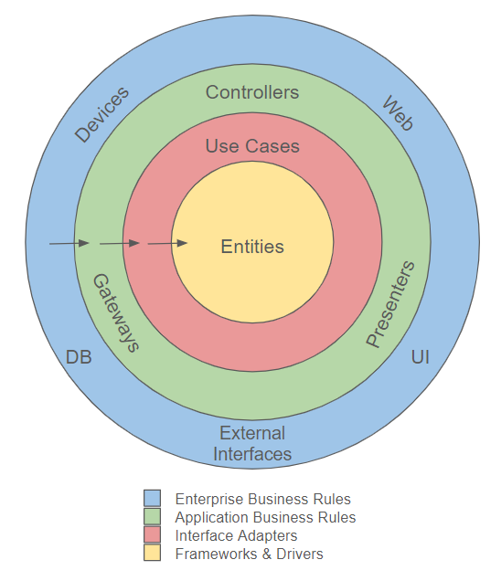

## Understanding Clean Architecture and SOLID Principles: A Guide for Developers
In the world of software development, creating maintainable, scalable, and robust applications is a key goal. Two crucial concepts that help developers achieve this are Clean Architecture and the SOLID Principles. Together, they form a strong foundation for building flexible and maintainable systems. Let's dive into both concepts and explore how they can be applied in practice.

### What is Clean Architecture?
Clean Architecture, introduced by Robert C. Martin (Uncle Bob), is a software design philosophy that emphasizes separation of concerns and independence between various components of a system. Its core idea is to build systems that are easy to maintain, extend, and test by organizing the code into layers with clearly defined boundaries.

### The main goals of Clean Architecture are:

- **Testability**: Each layer should be easy to test independently.
- **Maintainability**: Changes in one part of the system should not ripple through other parts.
- **Flexibility**: Systems should be flexible to accommodate future changes or new requirements.
- **Independence**: The system should be decoupled from frameworks, databases, and UI layers, so they can be changed without affecting the core logic.

### Key Layers in Clean Architecture:
1. **Entities (Core Layer):** These are the business objects or core models of the application. They represent the fundamental data and rules that govern your business domain, independent of any external framework, database, or other layers.
2. **Use Cases (Application Layer):** These contain the business rules and logic specific to how the system should behave. This layer interacts with the entities to solve specific business problems. Use cases focus on what the system should do without being concerned about how it's implemented (UI, database, etc.).
3. **Interface Adapters (Presentation Layer):** This layer is responsible for converting data from one form to another. It interacts with the user interface, database, or external systems, adapting inputs and outputs to match the needs of the core layers (entities and use cases).
4. **Frameworks & Drivers (Infrastructure Layer):** This is the outermost layer, containing infrastructure-specific details, such as frameworks, databases, APIs, or external libraries. This layer is considered volatile and subject to frequent changes, so it should not affect the inner core layers.
The key principle is that dependencies only flow inward. Inner layers should never depend on outer layers, but outer layers can depend on inner layers. This keeps the core logic free from the details of frameworks, databases, or external technologies.

---
### What are the SOLID Principles?
The SOLID Principles are a set of five design principles that help make code more flexible, maintainable, and easier to understand. These principles complement Clean Architecture by guiding how individual components and classes should be structured.

1. **S - Single Responsibility Principle (SRP):**
    - *Definition*: A class should have only one reason to change. It should be responsible for only one part of the functionality.
    - *Example*: If you have a class Invoice, it should only handle the logic related to managing invoices, not managing payment processing or generating reports. Each responsibility should be separated into its own class.

2. **O - Open/Closed Principle (OCP):**
    - *Definition*: Software entities (classes, modules, functions) should be open for extension but closed for modification.
    - *Example*: If you need to add a new feature to a class, you should extend its behavior (perhaps through inheritance or interfaces) without modifying the existing class directly. This avoids breaking existing functionality.

3. **L - Liskov Substitution Principle (LSP):**
    - *Definition*: Objects of a superclass should be able to be replaced with objects of a subclass without affecting the correctness of the program.
    - *Example*: If you have a base class Animal with a method speak(), any subclass, like Dog or Cat, should be able to replace Animal without causing issues, and they should implement speak() in a way that makes sense for them.

4. **I - Interface Segregation Principle (ISP):**
    - *Definition*: Clients should not be forced to depend on interfaces they do not use. This means it's better to have multiple small, specific interfaces rather than a large, general-purpose interface.
    - *Example*: If you have an interface IWorker with methods Work() and Manage(), not every worker might need to manage. In this case, it would be better to split the interface into IWorker and IManager to keep the responsibilities separate.

5. **D - Dependency Inversion Principle (DIP):**
    - *Definition*: High-level modules should not depend on low-level modules. Both should depend on abstractions (e.g., interfaces). Additionally, abstractions should not depend on details, but details should depend on abstractions.
    - *Example*: Instead of a class depending on a specific implementation, like SqlDatabase, it should depend on an interface like IDatabase. This way, you can easily switch to a different database (e.g., MongoDatabase) without changing the high-level module.
---

### How Clean Architecture and SOLID Principles Work Together

When combined, Clean Architecture and SOLID Principles create a powerful design philosophy:

1. **Separation of Concerns:** Clean Architecture defines clear boundaries between layers, and the SRP principle ensures that each class within those layers has a single responsibility.
2. **Flexibility & Extensibility:** The OCP principle aligns with Clean Architecture's idea of keeping the core independent of frameworks and external tools. By applying OCP, you can extend functionalities without modifying the core logic, keeping it clean and robust.
3. **Abstraction:** The DIP principle supports the idea of Clean Architecture’s inward flow of dependencies. Core logic depends on abstractions rather than concrete implementations, enabling easier swapping of infrastructure or UI components.
4. **Modularization:** Following the SOLID principles helps modularize each layer of Clean Architecture. For example, by using the ISP, you avoid large, monolithic interfaces, keeping the code more manageable across layers.
---
### Example: Applying Clean Architecture and SOLID to a Simple E-commerce Application
- **Entities (Core):** A class Product contains the attributes and rules of what defines a valid product (e.g., price, stock, etc.).
- **Use Cases (Application):** A ProcessOrder class handles the business logic for processing an order. It interacts with the Product entity to ensure there is enough stock before proceeding.
- **Interface Adapters (Presentation):** This layer adapts the output from ProcessOrder for a user interface (web or mobile) or converts it into data for storage.
- **Frameworks & Drivers (Infrastructure):** At this layer, you use a specific framework (e.g., a web framework like ASP.NET or Flask) or database (like PostgreSQL or MongoDB). These components can be swapped out without changing the business logic.
By following SOLID principles, each class and module within these layers is designed with a clear responsibility, extensibility in mind, and strong adherence to abstractions rather than concrete implementations.
---
### Conclusion
Combining Clean Architecture and SOLID principles creates a design approach that fosters scalability, maintainability, and flexibility. Clean Architecture ensures separation of concerns at the system level, while SOLID principles maintain good design practices at the class level. Together, they provide a structured way to build software systems that can adapt to change and grow over time while remaining robust and easy to understand.

Applying these principles may require upfront investment in terms of planning and design, but the long-term benefits in terms of maintainability, ease of extension, and testability make it a worthwhile approach for modern software development.
